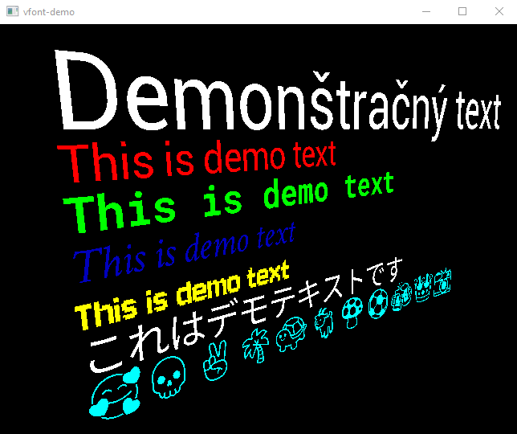

# VFONT DEMO APP



The demo app allows to get unicode input from the user and render it on the screen as vector text using Vulkan. The text is rendered by the library `vfont`, which is bundled with the demo app.

## Build demo app

`Vulkan` is required in this project. Supported windowing systems are `Win32`, `X11` and `Wayland`. The default windowing system on Linux is X11.

Example building and running demo app on Linux with make:

```
mkdir build && cd build
cmake ..
make
cd src
./vfont-demo
```

If you want to build documentation, use `cmake .. -DBUILD_DOC=ON`.

### Win32

To explicitly build for Win32, instead of `cmake ..` use `cmake .. -DPLATFORM=USE_WIN32`.

**Windows SDK** is required.

### X11

To explicitly build for X11 using Xlib, instead of `cmake ..` use `cmake .. -DPLATFORM=USE_X11`.

Required library is **xlib**.

### Wayland

To explicitly build for Wayland, instead of `cmake ..` use `cmake .. -DPLATFORM=USE_WAYLAND`.

Libraries required are **wayland**, **wayland-protocols** and **xkbcommon**.

## Run demo app

Example running demo app:

```
./vfont-demo [-h] [-c <perspective/orthographic>] [-s <demo/editor>]
```

### Options

- `-h`: Display the help message, showing the usage and available options.
- `-c <perspective/orthographic>`: Choose the camera type used for rendering. You can specify either `perspective` or `orthographic`.
- `-s <demo/editor>`: Select the mode of the app. You can choose either `demo` for a demonstration scene or `editor` for a trivial text editor.

## Used libraries

- [Freetype](https://www.freetype.org)
- [CDT](https://github.com/artem-ogre/CDT)
- [glm](https://github.com/icaven/glm)
- [xkbcommon](https://xkbcommon.org/)

[](https://www.gnu.org/licenses/gpl-3.0)
